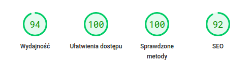
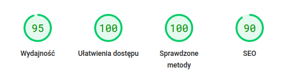
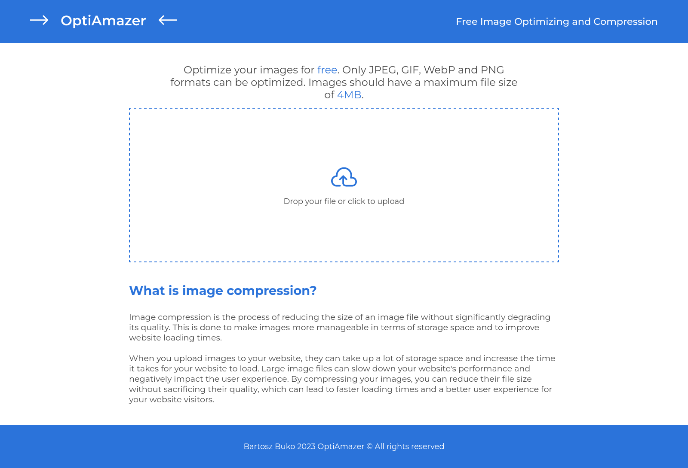
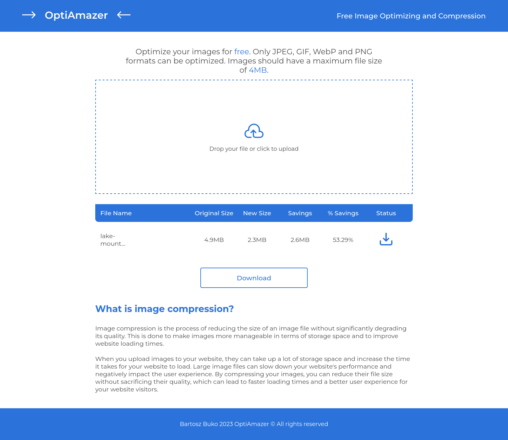

# OptiAmazer 👋

<div style="display: flex;">
  
  
</div>

## About 👀


Are you looking to add images to your website, but concerned about their size? Worry no more! ❗️ <br/> With my simple solution, you can upload any image you want and easily optimize it for your website. <br/> Simply upload your image, download the optimized version, and you're done! 🔝

More info below! ♦️

Mobile version: yes!

PageSpeed insights:

- [Mobile](https://pagespeed.web.dev/report?url=https%3A%2F%2Foptiamazer.up.railway.app%2F&form_factor=mobile): <br/>
   <br/>
- [Dekstop](https://pagespeed.web.dev/report?url=https%3A%2F%2Foptiamazer.up.railway.app%2F&form_factor=desktop): <br/>
  

## How can I try it? 🤔

Try now on: https://optiamazer.up.railway.app/ <br/>

## Instalation steps 📋

1. Copy this repository

```
gh repo clone BartoszBuko/optiamazer
cd ./optiamazer
```

or

```
git clone https://github.com/BartoszBuko/optiamazer.git
cd ./optiamazer
```

2. Install required packages

```
npm install
```

3. Open App in Development mode

```
npm start
```

Open https://localhost:3000 to view in the browser. <br/>
And that's all!

## About UX/UI 🖌️

I made design all by myself




Figma: [click here](figma.com/file/rOFgzEOrscVswF3FGiNVOt/Untitled?node-id=0%3A1) <br>

## Technological facilities 🛠️

Applicaton is based on Node.js (Express.js) <br/>
